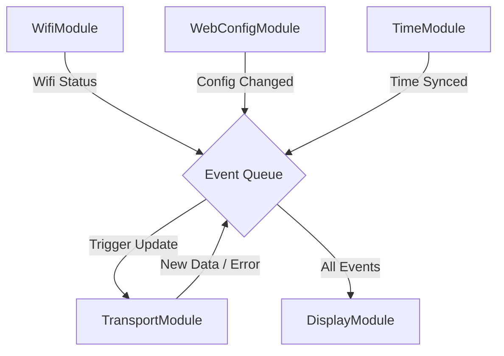

# Systemarchitektur: CrowPanel ÖV-Display

## 1. Übersicht

Das System ist modular aufgebaut. Die Firmware auf dem ESP32 besteht aus unabhängigen Modulen (Tasks), die lose gekoppelt sind und über definierte Events oder Queues kommunizieren. Die Benutzeroberfläche zur Konfiguration ist als Single Page Application (SPA) realisiert, die vom ESP32 ausgeliefert wird.

## 2. Firmware Architektur (ESP32)

Die Firmware ist in funktionale Module unterteilt. Jedes Modul kapselt seine Logik und läuft (wo sinnvoll) in einem eigenen FreeRTOS Task. `main.cpp` dient nur zur Initialisierung und "Verdrahtung".

### 2.1 Module

| Modul | Verantwortung | Interaktion |
|-------|---------------|-------------|
| **WifiModule** | Verwaltet WLAN-Verbindung (Station Mode) und Access Point (AP Mode). Reconnect-Logik. | Meldet: `EVENT_WIFI_CONNECTED`, `EVENT_WIFI_LOST`. |
| **TimeModule** | Synchronisiert Systemzeit via NTP. | Meldet: `EVENT_TIME_SYNCED`. Stellt `getLocalTime()` bereit. |
| **WebConfigModule** | Startet Webserver. Stellt REST-API bereit. Liefert Frontend-Files aus. | Liest/Schreibt: `ConfigStore`. Triggered: `EVENT_CONFIG_CHANGED`. |
| **TransportModule** | Fragt periodisch (oder bei Event) die Transport-API ab. Parst JSON. | Trigger: Timer (30s). Meldet: `EVENT_DATA_NEW`, `EVENT_DATA_ERROR`. Liest: `ConfigStore`. |
| **DisplayModule** | Verwaltet E-Paper Hardware. Zeichnet UI basierend auf Status. | Hört auf: `EVENT_DATA_NEW`, `EVENT_DATA_ERROR`, `EVENT_WIFI_...`. Verwaltet Power-Modes. |
| **ConfigStore** | Persistente Speicherung (NVS/Preferences). | Wird von allen Modulen gelesen. Geschrieben von `WebConfigModule`. |

### 2.2 Datenfluss & Kommunikation

Die Kommunikation erfolgt primär über eine zentrale **Event Queue** oder direkte Task-Notifications, um Thread-Safety zu gewährleisten.

## 3. Web Frontend Architektur

Die Konfigurationsoberfläche ist eine leichtgewichtige Web-App (Preact oder Vanilla JS), die im Flash-Speicher des ESP32 (LittleFS) liegt.

### 3.1 Struktur

*   **API Adapter:** Abstrahiert die REST-Calls zum ESP32 (`/api/config`, `/api/scan`, `/api/status`).
*   **State Store:** Hält den aktuellen Zustand der UI (z.B. gefundene WLANs, aktuelle Konfiguration).
*   **Router:** Einfaches Hash-Routing für Navigation.
*   **Views:**
    *   `SetupView`: WLAN-Scan und Verbindung.
    *   `ConfigView`: Suche nach Haltestellen, Auswahl der Linien/Richtung.
    *   `SystemView`: Statusanzeige, Logs, Reboot.

## 4. Technologie-Stack

*   **Firmware:** C++17, PlatformIO, Arduino Framework, FreeRTOS.
*   **Libraries:** ArduinoJson (Parsing), GxEPD2 (Display), ESPAsyncWebServer (Web/API).
*   **Frontend:** HTML5, CSS3, Modern JS (ES6+), evtl. Vite für Build-Prozess (produziert optimierte Assets für ESP32).
