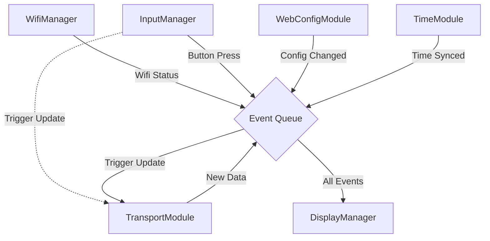
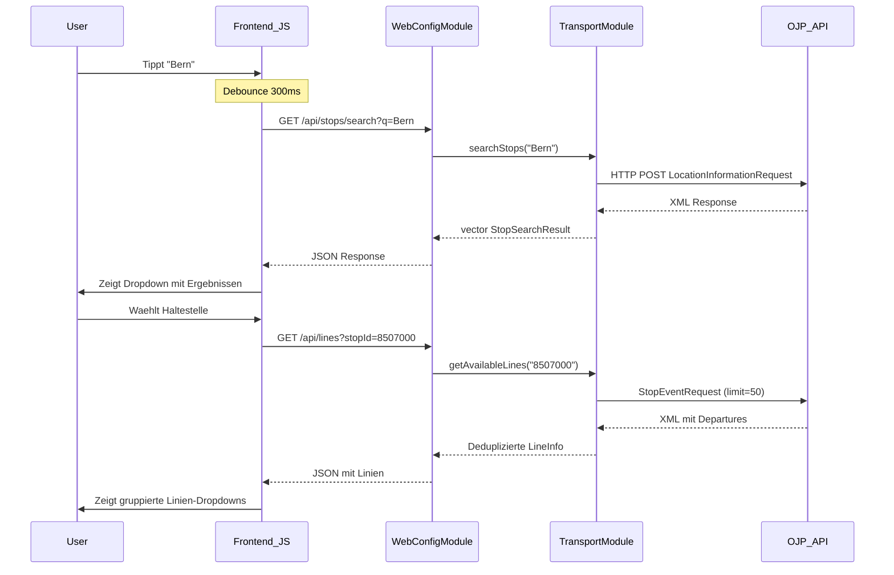
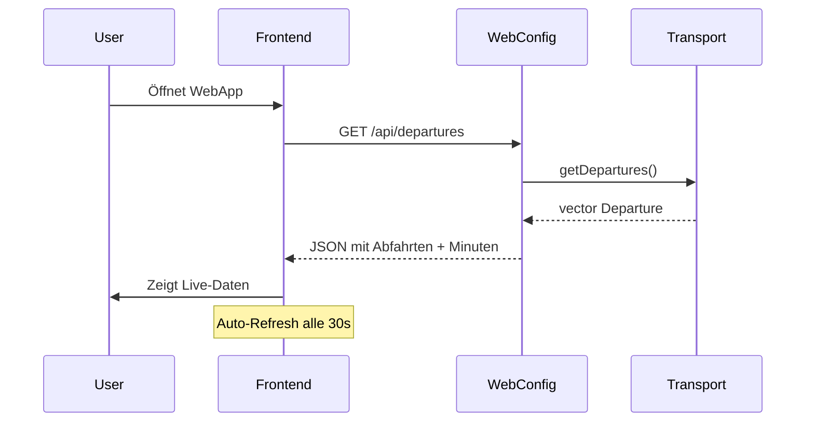

# Systemarchitektur: CrowPanel ÖV-Display

## 1. Übersicht

Das System ist modular aufgebaut. Die Firmware auf dem ESP32 besteht aus unabhängigen Modulen (Tasks), die lose gekoppelt sind und über definierte Events oder Queues kommunizieren. Die Benutzeroberfläche zur Konfiguration ist als Single Page Application (SPA) realisiert, die vom ESP32 ausgeliefert wird.

## 2. Firmware Architektur (ESP32)

Die Firmware ist in funktionale Module unterteilt. Jedes Modul kapselt seine Logik und läuft (wo sinnvoll) in einem eigenen FreeRTOS Task. `main.cpp` dient nur zur Initialisierung und "Verdrahtung".

### 2.1 Module

| Modul | Verantwortung | Interaktion |
|-------|---------------|-------------|
| **WifiManager** | Verwaltet WLAN-Verbindung (Station Mode) und Access Point (AP Mode). Reconnect-Logik. | Meldet: `EVENT_WIFI_CONNECTED`, `EVENT_WIFI_LOST`. |
| **InputManager** | Verwaltet Buttons (Menu, Exit, Rotary). Nutzt **Polling** statt Interrupts. | Meldet: `EVENT_BUTTON_...`. Triggert: Manual Update via `TransportModule`. |
| **SystemMonitor** | Überwacht Systemressourcen (Heap, Stack, Uptime) und loggt diese periodisch. | Loggt via `Logger`. |
| **TimeModule** | Synchronisiert Systemzeit via NTP. | Meldet: `EVENT_TIME_SYNCED`. Stellt `getFormattedTime()` bereit. |
| **WebConfigModule** | Startet Webserver. Stellt REST-API bereit. Liefert Frontend-Files aus. Bietet Haltestellensuche. | Liest/Schreibt: `ConfigStore`. Nutzt: `TransportModule` für Suche. |
| **TransportModule** | Fragt periodisch (oder bei Trigger) die OJP 2.0 API ab. Bietet Haltestellensuche. Nutzt `OjpParser` für XML. | Trigger: Timer (30s) oder Button. Meldet: `EVENT_DATA_AVAILABLE`. |
| **DisplayManager** | Verwaltet E-Paper Hardware. Zeichnet UI basierend auf Status. | Hört auf: `SystemEvent`. Verwaltet Power-Modes. |
| **ConfigStore** | Persistente Speicherung (NVS/Preferences). Setzt Standardwerte bei Erststart. | Wird von allen Modulen gelesen. Geschrieben von `WebConfigModule`. |

### 2.2 Datenfluss & Kommunikation

Die Kommunikation erfolgt primär über eine zentrale **Event Queue** oder direkte Task-Notifications (z.B. für manuelles Update).

Alle System-Events sind zentral in `src/Core/SystemEvents.h` definiert, um zirkuläre Abhängigkeiten zu vermeiden.

## 3. Web Frontend Architektur

Die Konfigurationsoberfläche ist eine leichtgewichtige Web-App (Vanilla JS), die im Flash-Speicher des ESP32 (LittleFS) liegt.

### 3.1 Struktur

*   **API Kommunikation:** Direkte `fetch` Calls an die REST-API (`/api/config`, `/api/scan`, `/api/status`, `/api/reset`, `/api/stops/search`, `/api/lines`, `/api/departures`).
*   **Logik:** `app.js` steuert den Ablauf.
*   **Views:** Dynamische DOM-Manipulation in `index.html` basierend auf dem Status (AP-Mode vs. Connected).
*   **Features:**
  - Intelligente Linienauswahl via Dropdown (automatisch geladen nach Haltestellenauswahl)
  - Live-Abfahrtsanzeige (zeigt dieselben Daten wie das E-Paper Display)
  - Favoriten-Feature (LocalStorage-basiert, letzte 5 Haltestellen)
  - Keyboard-Navigation (Pfeiltasten, Enter, Escape)
  - Toast-Notifications statt Browser-Alerts
  - Mobile-optimiert mit Touch-Targets
  - Auto-Refresh alle 30 Sekunden für Live-Daten

### 3.2 Haltestellensuche & Linienauswahl

### 3.3 Live-Abfahrtsanzeige

Die WebApp zeigt die aktuellen Abfahrten in Echtzeit an:

## 4. Technologie-Stack

*   **Firmware:** C++17, PlatformIO, Arduino Framework, FreeRTOS.
*   **Libraries:** ArduinoJson (Parsing), GxEPD2 (Display), ESPAsyncWebServer (Web/API), LittleFS (Dateisystem).
*   **Frontend:** HTML5, CSS3, Modern JS (ES6+). Keine Build-Tools notwendig.

## 5. Entwicklung neuer Module

Um die Wartbarkeit und Stabilität zu gewährleisten, müssen neue Module folgenden Richtlinien folgen:

### 5.1 Prinzipien
1.  **Kapselung:** Jedes Modul erhält einen eigenen Ordner in `src/`. Die gesamte Logik muss innerhalb der Klasse gekapselt sein. Globale Variablen sind zu vermeiden.
2.  **Autonomie:** Module sollten eigenständig funktionieren. Abhängigkeiten zu anderen Modulen sollten minimiert und explizit (z.B. per Dependency Injection im `begin()`) übergeben werden.
3.  **Minimaler Main-Code:** Die `main.cpp` dient **ausschließlich** der Instanziierung und dem Starten (`begin()`) der Module. Keine Logik in `setup()` oder `loop()`.
4.  **FreeRTOS Tasks:** Wenn ein Modul dauerhaft laufen oder periodisch Aufgaben erledigen muss, startet es intern seinen eigenen FreeRTOS Task. Die `taskCode` Methode muss `static` sein.
5.  **Logging:** Verwende ausschließlich die `Logger`-Klasse, keine direkten `Serial.print`.
6.  **Dokumentation:** Jedes Modul muss eine `README.md` in seinem Ordner enthalten, die die Verantwortlichkeiten, Abhängigkeiten und public API beschreibt.

### 5.2 Template für ein neues Modul
