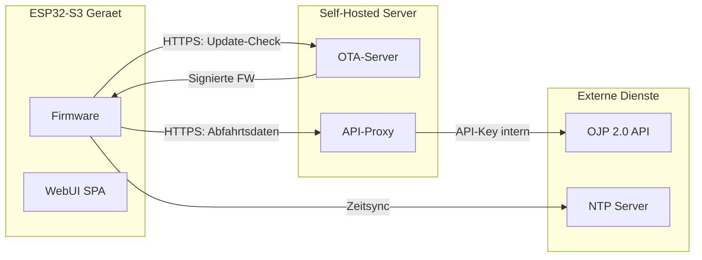
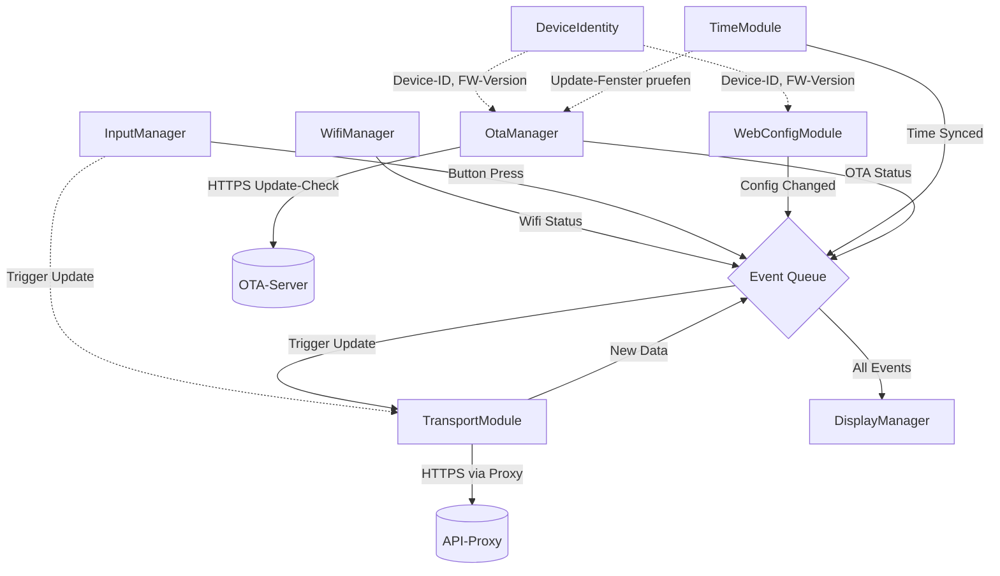
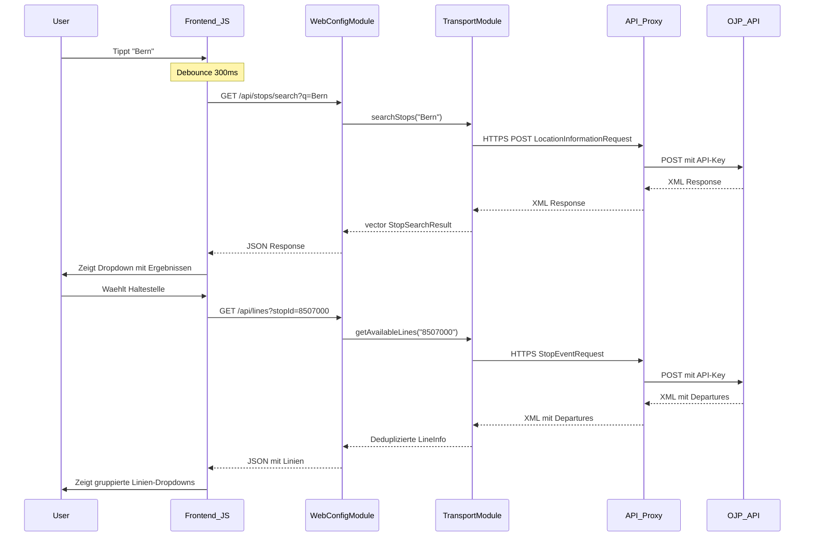
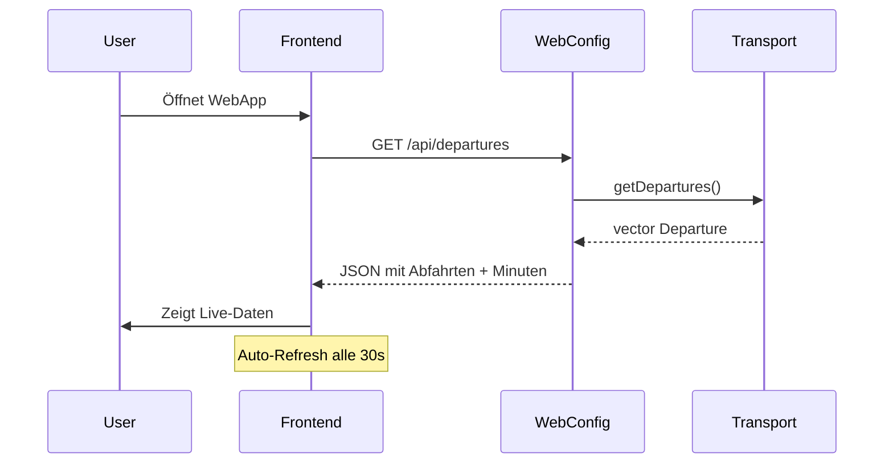
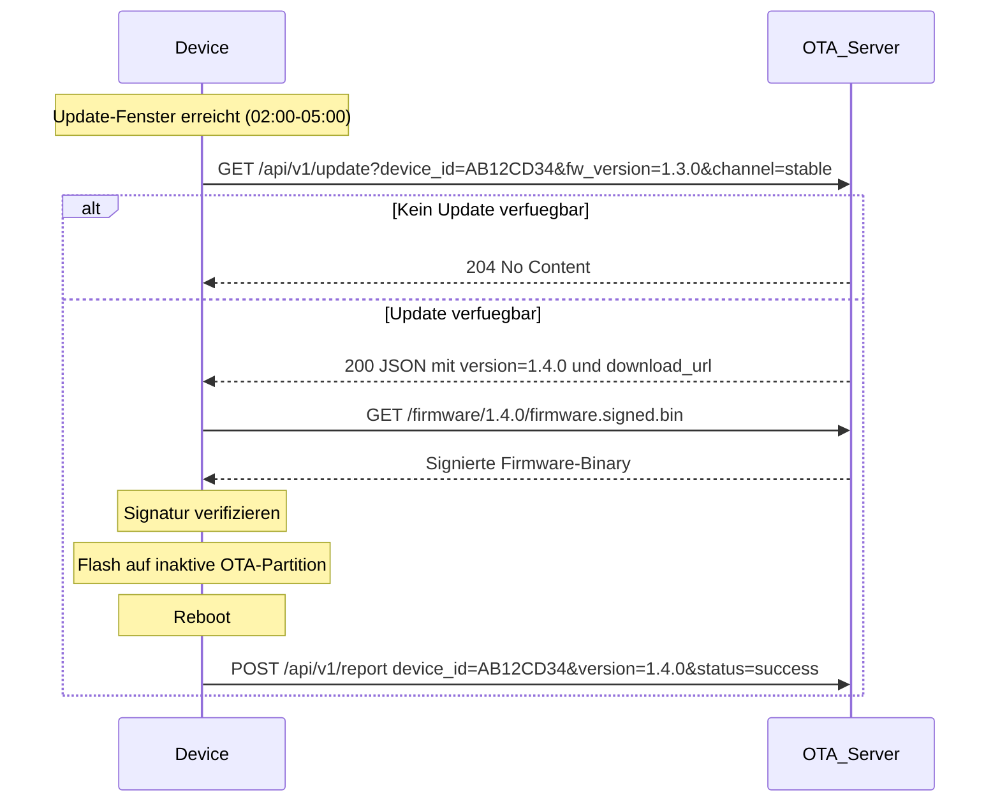

# Systemarchitektur: CrowPanel ÖV-Display

## 1. Übersicht

Das Gesamtsystem besteht aus drei Komponenten: dem **ESP32-Gerät** (Firmware + WebUI), dem **selbst gehosteten Backend** (OTA-Server + API-Proxy) und **externen Diensten** (OJP API, NTP). Die Firmware auf dem ESP32 ist modular aufgebaut und besteht aus unabhängigen Modulen (Tasks), die lose gekoppelt sind und über definierte Events oder Queues kommunizieren. Die Benutzeroberfläche zur Konfiguration ist als Single Page Application (SPA) realisiert, die vom ESP32 ausgeliefert wird.



## 2. Firmware Architektur (ESP32)

Die Firmware ist in funktionale Module unterteilt. Jedes Modul kapselt seine Logik und läuft (wo sinnvoll) in einem eigenen FreeRTOS Task. `main.cpp` dient nur zur Initialisierung und "Verdrahtung".

### 2.1 Module

| Modul | Verantwortung | Interaktion |
|-------|---------------|-------------|
| **WifiManager** | Verwaltet WLAN-Verbindung (Station Mode) und Access Point (AP Mode). Reconnect-Logik. | Meldet: `EVENT_WIFI_CONNECTED`, `EVENT_WIFI_LOST`. |
| **InputManager** | Verwaltet Buttons (Menu, Exit, Rotary). Nutzt **Polling** statt Interrupts. | Meldet: `EVENT_BUTTON_...`. Triggert: Manual Update via `TransportModule`. |
| **SystemMonitor** | Überwacht Systemressourcen (Heap, Stack, Uptime) und loggt diese periodisch. | Loggt via `Logger`. |
| **TimeModule** | Synchronisiert Systemzeit via NTP. | Meldet: `EVENT_TIME_SYNCED`. Stellt `getFormattedTime()` bereit. |
| **WebConfigModule** | Startet Webserver. Stellt REST-API bereit. Liefert Frontend-Files aus. Bietet Haltestellensuche. | Liest/Schreibt: `ConfigStore`. Nutzt: `TransportModule` für Suche. |
| **TransportModule** | Fragt periodisch (oder bei Trigger) die OJP 2.0 API ab. Bietet Haltestellensuche. Nutzt `OjpParser` für XML. | Trigger: Timer (30s) oder Button. Meldet: `EVENT_DATA_AVAILABLE`. |
| **DisplayManager** | Verwaltet E-Paper Hardware. Zeichnet UI basierend auf Status. | Hört auf: `SystemEvent`. Verwaltet Power-Modes. |
| **ConfigStore** | Persistente Speicherung (NVS/Preferences). Setzt Standardwerte bei Erststart. | Wird von allen Modulen gelesen. Geschrieben von `WebConfigModule`. |
| **OtaManager** | Prüft nachts auf Firmware-Updates, lädt signierte Binaries, verifiziert Signatur, flasht auf inaktive OTA-Partition, Rollback bei Fehler. | Nutzt: `DeviceIdentity`, `ConfigStore`, `TimeModule`. Meldet: `EVENT_OTA_STATUS`. |
| **DeviceIdentity** | Generiert/liest eindeutige Device-ID aus MAC-Adresse. Stellt Firmware-Version (SemVer) bereit. Meldet Geräte-Infos an Backend. | Wird von `OtaManager`, `WebConfigModule` gelesen. |

### 2.2 Datenfluss & Kommunikation

Die Kommunikation erfolgt primär über eine zentrale **Event Queue** oder direkte Task-Notifications (z.B. für manuelles Update).

Alle System-Events sind zentral in `src/Core/SystemEvents.h` definiert, um zirkuläre Abhängigkeiten zu vermeiden.



## 3. Web Frontend Architektur

Die Konfigurationsoberfläche ist eine leichtgewichtige Web-App (Vanilla JS), die im Flash-Speicher des ESP32 (LittleFS) liegt.

### 3.1 Struktur

*   **API Kommunikation:** Direkte `fetch` Calls an die REST-API (`/api/config`, `/api/scan`, `/api/status`, `/api/reset`, `/api/stops/search`, `/api/lines`, `/api/departures`).
*   **Logik:** `app.js` steuert den Ablauf.
*   **Views:** Dynamische DOM-Manipulation in `index.html` basierend auf dem Status (AP-Mode vs. Connected).
*   **Features:**
  - Intelligente Linienauswahl via Dropdown (automatisch geladen nach Haltestellenauswahl)
  - Live-Abfahrtsanzeige (zeigt dieselben Daten wie das E-Paper Display)
  - Favoriten-Feature (LocalStorage-basiert, letzte 5 Haltestellen)
  - Keyboard-Navigation (Pfeiltasten, Enter, Escape)
  - Toast-Notifications statt Browser-Alerts
  - Mobile-optimiert mit Touch-Targets
  - Auto-Refresh alle 30 Sekunden für Live-Daten

### 3.2 Haltestellensuche & Linienauswahl



### 3.3 Live-Abfahrtsanzeige

Die WebApp zeigt die aktuellen Abfahrten in Echtzeit an:



## 4. Technologie-Stack

*   **Firmware:** C++17, PlatformIO, Arduino Framework, FreeRTOS.
*   **Libraries:** ArduinoJson (Parsing), GxEPD2 (Display), ESPAsyncWebServer (Web/API), LittleFS (Dateisystem), esp_https_ota (OTA).
*   **Frontend:** HTML5, CSS3, Modern JS (ES6+). Keine Build-Tools notwendig.
*   **Backend:** Selbst gehosteter Server (Technologie noch offen). OTA-Server + API-Proxy.
*   **Sicherheit:** Espressif Secure Boot V2, HTTPS mit Root-CA-Validierung, Firmware-Signierung.

## 5. Partitionslayout

Das Gerät nutzt eine Custom-Partitionstabelle für 8MB Flash mit OTA-Support. Dateiname: `partitions_ota.csv`.

```
# Name,      Type, SubType,  Offset,    Size,      Flags
nvs,          data, nvs,      0x9000,    0x5000,
otadata,      data, ota,      0xe000,    0x2000,
ota_0,        app,  ota_0,    0x10000,   0x1E0000,
ota_1,        app,  ota_1,    0x1F0000,  0x1E0000,
spiffs,       data, spiffs,   0x3D0000,  0x220000,
coredump,     data, coredump, 0x5F0000,  0x10000,
```

| Partition | Grösse | Zweck |
|-----------|--------|-------|
| **nvs** | 20 KB | Non-Volatile Storage für Konfiguration (WiFi, Haltestelle, Sprache, etc.) |
| **otadata** | 8 KB | Speichert, welche OTA-Partition (ota_0 oder ota_1) aktuell aktiv ist |
| **ota_0** | 1.875 MB | App-Slot 1 — Firmware |
| **ota_1** | 1.875 MB | App-Slot 2 — Ziel für OTA-Updates, dann Umschaltung |
| **spiffs** | 2.125 MB | LittleFS-Dateisystem für WebUI-Dateien (HTML, JS, CSS) |
| **coredump** | 64 KB | Speicherabbild bei Crashes für Post-Mortem-Analyse |

**Hinweis:** Beide App-Slots (ota_0, ota_1) sind identisch gross. Beim normalen USB-Flash wird ota_0 beschrieben. Bei einem OTA-Update wird die neue Firmware auf den inaktiven Slot geschrieben, danach wird umgeschaltet. Falls der neue Boot fehlschlägt, wird automatisch auf den vorherigen Slot zurückgewechselt (Rollback).

## 6. Backend-Architektur

Das Backend läuft auf einem selbst gehosteten Server und besteht aus zwei Diensten:

### 6.1 OTA-Server

Verantwortlich für Firmware-Versionsverwaltung und Update-Auslieferung.

**Endpunkte:**

| Endpunkt | Methode | Beschreibung |
|----------|---------|--------------|
| `/api/v1/update` | GET | Prüft ob Update verfügbar. Parameter: `device_id`, `fw_version`, `channel` |
| `/firmware/{version}/firmware.signed.bin` | GET | Liefert die signierte Firmware-Binary |
| `/api/v1/report` | POST | Gerät meldet Update-Ergebnis (Erfolg/Fehlschlag) |

**Konzepte:**

*   **Device-Gruppen:** Geräte sind einem Update-Channel zugeordnet (`test` oder `stable`). Test-Geräte erhalten Updates zuerst.
*   **Manifest:** Der Server verwaltet pro Channel die aktuelle Zielversion und die zugehörige Binary.
*   **Staged Rollout:** Erst werden Geräte im Channel `test` aktualisiert. Nach erfolgreicher Validierung wird die Version für `stable` freigegeben.



### 6.2 API-Proxy

Leitet die OJP-API-Anfragen weiter und hält den API-Key serverseitig.

**Endpunkte:**

| Endpunkt | Methode | Beschreibung |
|----------|---------|--------------|
| `/ojp` | POST | Nimmt OJP-XML-Requests entgegen, fügt API-Key hinzu, leitet an `api.opentransportdata.swiss` weiter |

**Aufgaben:**
*   API-Key wird ausschliesslich auf dem Server gespeichert
*   Rate-Limiting pro Device-ID (Schutz vor Missbrauch)
*   Optional: Caching von häufigen Anfragen

## 7. Sicherheitsarchitektur

### 7.1 Firmware-Signierung

Die Firmware wird vor der Auslieferung kryptographisch signiert. Das Gerät verifiziert die Signatur vor der Installation.

*   **Algorithmus:** ECDSA mit secp256r1 (oder RSA-2048, noch zu klären — siehe Anforderungsdokument Q-02)
*   **Private Key:** Liegt ausschliesslich auf dem Build-Server/Entwicklerrechner. Wird niemals auf das Gerät übertragen.
*   **Public Key:** Ist in der Firmware eingebettet und wird zur Verifizierung verwendet.
*   **Prozess:** Build → Signierung → Upload auf OTA-Server → Gerät lädt herunter → Signatur prüfen → Flash

### 7.2 HTTPS & Zertifikate

Alle Verbindungen zwischen Gerät und Backend nutzen HTTPS mit Root-CA-Validierung.

*   Ein Root-CA-Zertifikat (z.B. Let's Encrypt ISRG Root X1) wird im Firmware-Binary eingebettet
*   `setInsecure()` ist im Produktions-Build nicht erlaubt (nur im Entwicklungs-Build)
*   Bei Zertifikatswechsel auf dem Server muss ggf. ein Firmware-Update mit dem neuen CA-Zertifikat ausgeliefert werden

### 7.3 Rollback-Mechanismus

Der ESP32 OTA-Mechanismus bietet eingebauten Rollback-Schutz:

1.  Nach dem Flash auf die neue Partition wird diese als "pending verification" markiert
2.  Das Gerät bootet in die neue Partition
3.  Die neue Firmware muss sich innerhalb einer definierten Zeit (z.B. 60s) als gültig markieren (`esp_ota_mark_app_valid_cancel_rollback()`)
4.  Kriterien für "gültig": WiFi-Verbindung erfolgreich, mindestens ein API-Call erfolgreich
5.  Falls die Markierung nicht erfolgt (Crash, Boot-Loop), startet der Bootloader automatisch die vorherige Partition

## 8. Build-Profile

Die `platformio.ini` definiert zwei Build-Profile für Entwicklung und Produktion:

### 8.1 Development (`[env:esp32s3]`)

*   Upload via USB
*   Serial-Debug aktiv
*   `CORE_DEBUG_LEVEL=3` (verbose)
*   `setInsecure()` für HTTPS erlaubt (Entwicklung ohne eigene Zertifikate)
*   Keine Firmware-Signierung

### 8.2 Production (`[env:esp32s3_production]`)

*   OTA-fähig
*   `CORE_DEBUG_LEVEL=1` (nur Fehler)
*   HTTPS mit Root-CA-Validierung erzwungen
*   Firmware wird nach dem Build signiert
*   Debug-Delays entfernt

Beide Profile nutzen die **gleiche Partitionstabelle** (`partitions_ota.csv`), damit Geräte sowohl via USB als auch via OTA aktualisiert werden können.

## 9. Entwicklung neuer Module

Um die Wartbarkeit und Stabilität zu gewährleisten, müssen neue Module folgenden Richtlinien folgen:

### 9.1 Prinzipien
1.  **Kapselung:** Jedes Modul erhält einen eigenen Ordner in `src/`. Die gesamte Logik muss innerhalb der Klasse gekapselt sein. Globale Variablen sind zu vermeiden.
2.  **Autonomie:** Module sollten eigenständig funktionieren. Abhängigkeiten zu anderen Modulen sollten minimiert und explizit (z.B. per Dependency Injection im `begin()`) übergeben werden.
3.  **Minimaler Main-Code:** Die `main.cpp` dient **ausschließlich** der Instanziierung und dem Starten (`begin()`) der Module. Keine Logik in `setup()` oder `loop()`.
4.  **FreeRTOS Tasks:** Wenn ein Modul dauerhaft laufen oder periodisch Aufgaben erledigen muss, startet es intern seinen eigenen FreeRTOS Task. Die `taskCode` Methode muss `static` sein.
5.  **Logging:** Verwende ausschließlich die `Logger`-Klasse, keine direkten `Serial.print`.
6.  **Dokumentation:** Jedes Modul muss eine `README.md` in seinem Ordner enthalten, die die Verantwortlichkeiten, Abhängigkeiten und public API beschreibt.

### 9.2 Template für ein neues Modul
